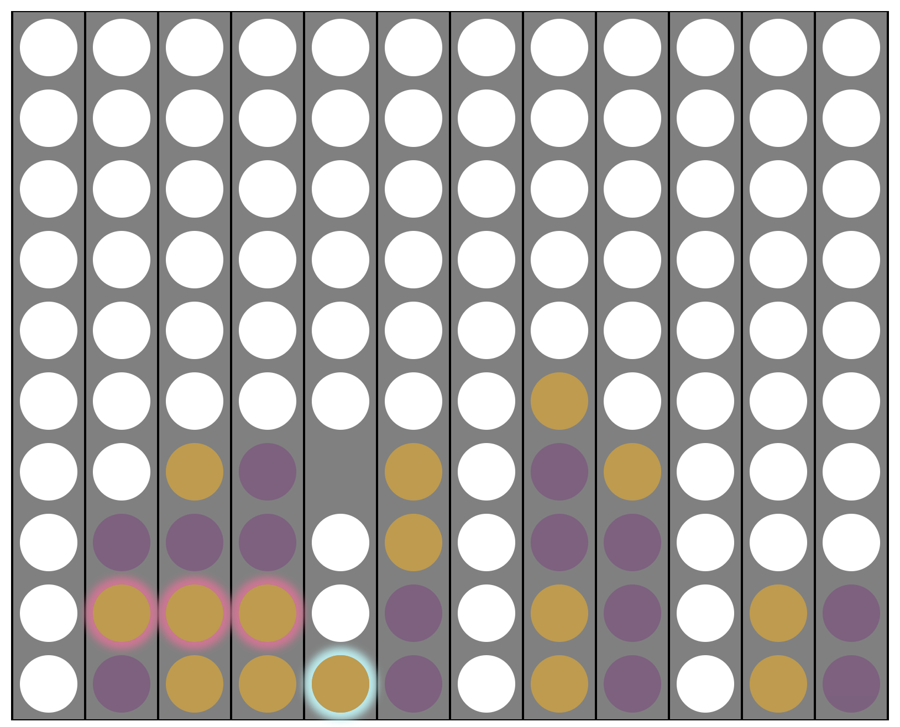
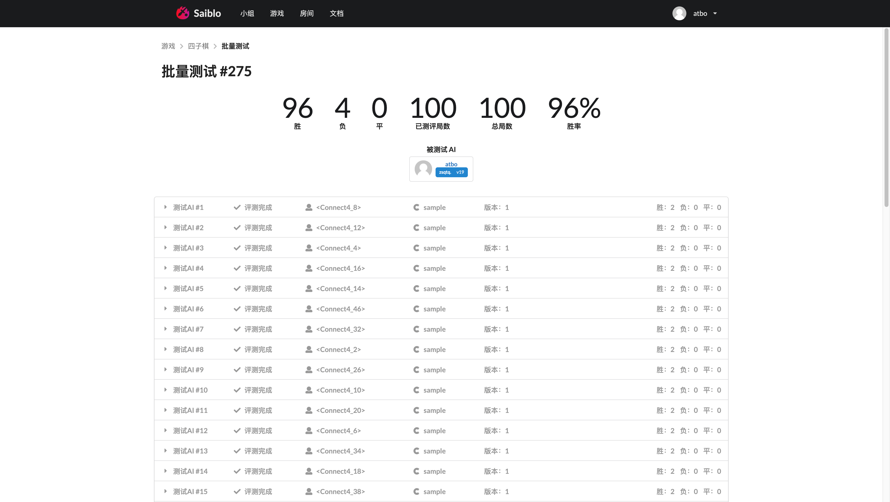

# 四子棋实验报告

计83 谢云桐 2018011334

## 1. 文件结构

- report.pdf：实验报告

- 2018011334.dll：windows下可执行文件。**不推荐使用**

- connect4-saiblo.zip：供Saiblo平台使用的源代码（c++ with makefile)。**推荐使用**

  - sdk：saiblo平台测试需要的库文件
  - Array.h：自己简单封装的一个向量，固定长度提高效率。
  - constants.h：程序中用到的常数、参数以及策略选择
  - function.h：程序中需要的一些基础函数
  - Judge.cpp：实验提供的判断胜负函数，仅仅只对二维数组的表示方式稍作修改
  - Judge.h：同上
  - main.cpp：主函数，仅仅本地debug使用，生成随机棋盘让进行相同策略的对弈
  - Makefile：make编译
  - Point.h：实验提供的落点类，未修改
  - Strategy.cpp：实验提供的程序入口，`getPoint`添加了调用搜索算法的部分，其他未修改
  - Strategy.h：实验提供的程序入口，未修改
  - UCT.cpp：实现MCTS的函数
  - UCT.h: 蒙特卡洛树类以及节点类的定义

- result：在线测试结果的截图

  - guidedPolicy-vs-defaultPolicy.png：估值策略与随机策略对抗
  - guidedPolicy-vs-50.png：估值策略与50个样例对抗
  - defaultPolicy-vs-50.png：随机策略与50个样例对抗

  

## 2. 运行环境

本程序在 windows 下使用 Visual Studio 2019 Community 编写，但是本地（本机 windows）测试与在线测试**结果差别极大**，考虑到最终评测将在saiblo平台上进行，因此以下内容如无特殊说明，均为**在线测试结果**。在线测试账号为 **"atbo"**，最终版本 **zsqtql ver19**。


## 3. 实验算法

### 3.1 算法选择

课程上讲授的比较成熟的对抗搜索算法主要有两种：Alpha-Beta 剪枝和MCTS（蒙特卡洛树搜索）。在进行实验前，我先在线与AI进行了几盘四子棋游戏，我的战绩是全败，而且也完全总结不出四字棋的规律，找不到评价局面的方法。因此只得暂时放弃实验报告中的 Alpha-Beta 剪枝算法，使用无需先验知识的MCTS。因为老师上课讲授MCTS算法较为简略，因此我参考了[这一网站](https://www.geeksforgeeks.org/ml-monte-carlo-tree-search-mcts/)上的算法说明。

### 3.2 算法细节

MCTS的大致步骤就是先从根部开始，通过UCB（信心上界）选择最优的子节点，一路向下直至可拓展节点进行拓展，然后从拓展的节点开始随机模拟直至分出胜负，最后再根据结果从拓展节点回溯至根部，更新路途中节点的记录。

MCTS在选择最优节点时需要兼顾对未充分了解节点的探索与对表现较好节点的利用，这就要求我们在UCB公式中既考虑该节点的胜率，也考虑它的访问次数，因此本程序使用了老师上课给出的UCB公式：
$$
I_j = \overline {X_j} + c \sqrt{\frac{ln(n)}{T_j(n)}}
$$
其中 $I_j$ 为该节点的UCB，$\overline {X_j} $表示该点的胜率，$n$ 表示当前总的模拟次数（完成回溯次数，初始设为1防止下溢出），$T_j(n)$表示该点的访问次数，$c$ 是一个常数，在此采取经验值 $1$。

在经过足够多次模拟后（本程序设定时间超过2.5s）需要选择一个落子方案返回，本程序中我们选择根节点的子节点中访问次数最多的节点对应的行动作为结果。

### 3.3 测试与优化

#### 3.3.1 朴素的MCTS

利用在上一部分描述的最初版本算法（对应saiblo上的 ver13）进行批量测试，结果如下：


对战50个样例共100次，97胜3负，朴素的MCTS算法已经有了97%的胜率，表现已经比较优秀。如果继续优化的话，大致可以分为两种思路，一种是调参，一种是改变算法实现方式。本程序中的超参数只有 UCB 公式中的探索参数 $c$，但是计算资源有限，不允许进行细致的调参测试，而且现在选取的 $1$ 已经是经验最优值，因此我选择改变算法细节来进行优化。

#### 3.3.2 特定对局研究

研究失败的案例，我发现本程序的AI策略会在残局进行极不合理的决策。如下图所示，我方执紫，此时对方已经将军，无论如何都应在4列落子解围，然而测试时我方却在7列落子。将该棋局输入本地，进入调试模式观察模拟结果，发现是每一种走法均有劣势，相差不大（虽然我并没有看出来我方处于明显劣势……），因此落子点的选择有一定的随机性。针对这一现象，我首先想到的是进行剪枝，即如果有必胜策略，那么仅保留这一个子节点，舍弃其所有的兄弟。但是我认为这虽然可能可以提升表现，但是这仅仅是针对将军残局这种特定情况的优化，不能从根本上解决问题。如果该步是必败要不要剪枝？如果两步以后必胜要不要剪枝？究其根本，这种情况出现的原因在于拓展后的模拟过程不准确。如果我方不在4列落子，那么下一步对方应该必然在4列落子，导致该种走法的胜率为0。但是由于黄方的走子策略是随机的，因此其有很大概率浪费掉这一绝杀机会。可见模拟过程中双方的走法都是十分不合理的。



#### 3.3.3 带有估值的模拟

MCTS模拟的目的是评估该节点（以及其所有祖先）的表现。在实际比赛时，高水平选手采取的策略会与本程序采取的随机策略相去甚远，模拟次数不足时（根据调试数据，一般每步只能进行100万次以内的模拟）随机策略并不能很好地评估节点表现。因此我决定更换模拟时的策略，在进行模拟时对每一步的走法进行简单的估值，然后利用轮盘赌（见遗传算法课堂内容）的方法加权随机决定采取什么方案。

每一步棋大体上要实现两个目标：进攻和防守。防守可以看作阻止对方的进攻，所以估值时可以认为是我方落子于此的进攻得分 + 对方落子于此的进攻得分，代码如下：

```c++
moveScores[i] = getMoveScore(avaiMoves[i].x, avaiMoves[i].y, M, N, currentBoard, currentPlayer);
moveScores[i] += getMoveScore(avaiMoves[i].x, avaiMoves[i].y, M, N, currentBoard, anotherPlayer(currentPlayer));
```

进攻得分的代码基本框架来自 “Judge.cpp” 中评价胜负的函数。一步棋有四个进攻方向，分别为横向，左上-右下斜向，左下-右上斜向以及纵向。而前三种又有两个次级进攻方向，以横向为例，即左向和右向。下面将以横向为例说明估值函数的细节，斜向与横向类似，纵向则是横向的简化版。

首先，如果该棋必胜（即连结四个以上），那么返回一个大整数作为估值，否则，分别考虑左右的进攻潜力，以下棋局为例，我方为1，评估A处的落子：

1 1 0 A 1 0 0 1

A和右边共连续两个1肯定要纳入进攻潜力的范围。先向左，中间间隔一个0，该函数认为此种情况也会计入连续的进攻潜力，也就是说认为向左A的进攻潜力为4颗棋子。向右，A和右边的1与再右边的1之间间隔两个0，该函数认为间隔两个以上的0或间隔对方棋子，则不再统计之后的棋子，其向右的进攻潜力为2颗棋子。最后用一下函数将棋子数转换为得分，再将左右方向得分相加：

```c++
inline int aCount2Score(int count) //convert a consecutive line to score
{
    switch (count)
    {
    case 0:
        return 0;
    case 1:
        return 1;
    case 2:
        return 4;
    default:
        return 10;
    }
}
```

此函数也有许多调整优化的空间，但是正如前文所述，测试成本过高，只能暂且采用此版本（saiblo上ver19）。

测试结果如下：



结果反而不如随机模拟，但是相差很小。查看调试信息，发现带有估值的模拟总共的模拟次数仅有不带估值模拟的1/4，相差不是非常大，似乎不应该表现更差，有可能是因为二者的胜率都非常高，因此放大了偶然性误差。因为资源限制，重复多次实验取均值，因此我让二者互相对弈一百局，结果如下：


通过这一结果，基本可以断定估值函数的确改进了AI的表现，之前实验的结果是由偶然误差造成的。

最后，截止到该报告撰写的时间（2019.4.25, 10:30），该版本位列saiblo天梯第28位（共208位），成绩较好。

## 4. 结论与思考

本次实验通过MCTS算法实现四子棋AI程序，并引入估值函数优化了模拟过程。与助教提供的样例的对抗中取得了较好的成果，胜率稳定在95%以上，而且在saiblo天梯上也位列前30。

但是我认为该程序还有很大的优化空间，只是限于时间原因无法实现。首先是之前提到的剪去必胜的兄弟以及必败节点，可以避免很多无用的搜索。其次是可以请了解四字棋的选手，设计更为合理且快速估值函数。除此以外，目前版本的程序是“尽可能”拓展，即每次都从新节点开始模拟（除非还未拓展游戏就已经结束），可以改进为每个节点模拟一定次数（如10次）以后再开始拓展。最后还有调参问题，如果有足够算力的话这点应该是较容易优化的。

