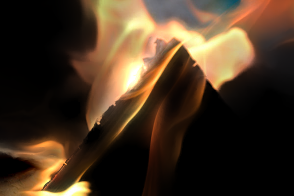
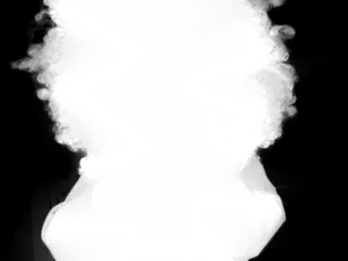
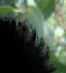

# report


## 工作内容

实现单张图片抠图。先计算前景不透明度 $\alpha$，再计算前景与背景图像，基础公式为
$$
I_i=\alpha_i F_i+(1-\alpha_i)B_i
$$
以 python 实现，使用 numpy 进行矩阵运算，scipy 进行方程求解，仅在图像输入输出部分使用 opencv 辅助，不涉及核心算法

### 运行方法

`./run.sh` 获得所有实验结果，可自定义参数如下：

```shell
usage: main.py [-h] [--image_path IMAGE_PATH] [--scribe_path SCRIBE_PATH] [--output_dir OUTPUT_DIR]
```


## 效果展示

| 原图                                                   | 涂抹图                                                     | 不透明度                                          | 前景                                                        | 背景                                                        |
| ------------------------------------------------------ | ---------------------------------------------------------- | ------------------------------------------------- | ----------------------------------------------------------- | ----------------------------------------------------------- |
|  |  |  |  |  |
|                            |                            |               |               |               |
|                            |                            |               |               |               |
|                            |                            |               |               |               |
|                  |                  |          |          |          |

可见除了火山图外，剩下四张图的抠图效果都极好，很完善得区分了前景和背景。而火山图虽然效果稍差，但是也达到了了和原 paper 相似的效果，这可能是由于火山图像素较多、图片复杂、前景背景颜色杂糅且相近同时涂抹标记不明显所致。


## 参考资料

[github python code](https://github.com/MarcoForte/closed-form-matting)

[paper matlab code](http://www.alphamatting.com/code.php)

Levin, Anat, Dani Lischinski, and Yair Weiss. "A closed-form solution to natural image matting." *IEEE transactions on pattern analysis and machine intelligence* 30.2 (2007): 228-242.