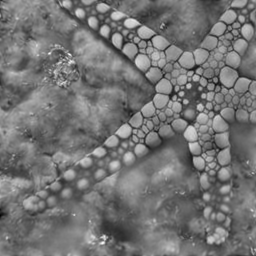
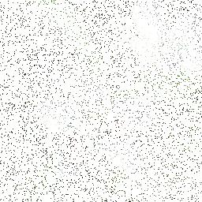

# report


## 工作内容

用计图实现了SIREN网络的映射拟合训练，并实现了泊松图像重建（拉普拉斯）、图像编辑以及图像补全相关应用。支持对不同分辨率的的彩色和黑白图片的处理

### 网络结构

使用 Sine 函数激活 MLP，神经网络包含输入层、输出层以及三层隐藏层，隐藏层，网络结构代码如下：

```python
def linear_init(first_layer, in_features, out_features):
    linear = nn.Linear(in_features, out_features)
    if first_layer:
        jittor.init.uniform_(linear.weight, (-1 / in_features), (1 / in_features))
    else:
        jittor.init.uniform_(linear.weight, -np.sqrt(6 / in_features) / 30, np.sqrt(6 / in_features) / 30)
    return linear


class Sine(nn.Module):

    def __init__(self):
        super().__init__()

    def execute(self, input_var):
        return jittor.sin(30 * input_var)


class Siren(nn.Module):

    def __init__(self, out_features):
        super().__init__()
        self.net = nn.Sequential(
            linear_init(True, IN_FEATURES, HIDDEN_FEATURES),
            Sine(),
            *[nn.Sequential(linear_init(False, HIDDEN_FEATURES, HIDDEN_FEATURES), Sine()) for _ in
              range(HIDDEN_LAYERS)],
            linear_init(False, HIDDEN_FEATURES, out_features)
        )

    def execute(self, input_var: jittor.Var):
        input_var = input_var.clone().detach()
        out = self.net(input_var)
        return {
            OUT_KEY: out,
            IN_KEY: input_var
        }
```

输入为图像坐标，注意参数的初始化使用了 SIREN 文章中推荐的方法，尤其是第一层之后的初始化较为特别，这也是 SIREN 表现优秀的关键所在

### 应用实现

图像拟合和另外三种应用的实现位于 `main.py`，这四个任务的过程都极为相似，均为训练 SIREN 网络，区别主要在于对 loss 的计算，这四个任务分别定义了不同的损失函数以及用于对比的 ground truth，分别为 像素mse、拉普拉斯 mse、两图梯度 mse 以及残缺像素 mse。图像补全工作稍显特殊，其训练时的输入数据为残缺坐标，输出结果时输入完整坐标

### 实验过程

本项目所有实验均训练1000个epoch，可通过 `./run.sh` 进行实验，支持自定义的参数如下：

```bash
usage: main.py [-h] [--task TASK] [--input_path INPUT_PATH]
               [--output_dir OUTPUT_DIR] [--channels CHANNELS]
               [--sidelength SIDELENGTH] [--epochs EPOCHS] [--lr LR]
               [--ot_image_path OT_IMAGE_PATH] [--points POINTS]
```


## 效果展示

### 图像拟合

| 原图                       | SIREN拟合                      |
| -------------------------- | ------------------------------ |
|  |  |

可见拟合效果极佳，肉眼很难看出区别。训练结束时 loss 数量级在 $10^{-4}$，基本收敛。同时因为 SIREN 网络结构简单，训练速度也极为优秀

### 泊松图像重建

| 原图                           | 泊松拟合                            |
| ------------------------------ | ----------------------------------- |
|  |  |

可见效果有限，与原图有较大差距，但是也已收敛。这一实验也在 SIREN paper 中进行，效果也相近。由此可知拉普拉斯算子作监督的时候拟合效果一般，并不非常适用本场景。

### 图像编辑

| 图1                      | 图2                    | 叠加图                               |
| ------------------------ | ---------------------- | ------------------------------------ |
|  |  |  |

可见编辑效果极好，成功将两图变化不大的空白部分用另一图替代，这也符合梯度监督的特点，在每个区域拟合梯度较大的一张图

### 图像补全

| 原图                       | 残缺图（随机5000个像素）           | 重构图                             |
| -------------------------- | ---------------------------------- | ---------------------------------- |
|  |  |  |

残缺图近保留了十分之一左右的像素，其信息已经相当模糊，根本无法判断原图内容。而通过 SIREN 拟合后再输入完整坐标，结果图可清洗判断原图内容，虽在清晰度上仍有欠缺，但显然远远优于残缺图


## 参考资料

Sitzmann, Vincent, et al. "Implicit neural representations with periodic activation functions." *arXiv preprint arXiv:2006.09661* (2020).

[github code](https://github.com/vsitzmann/siren)

